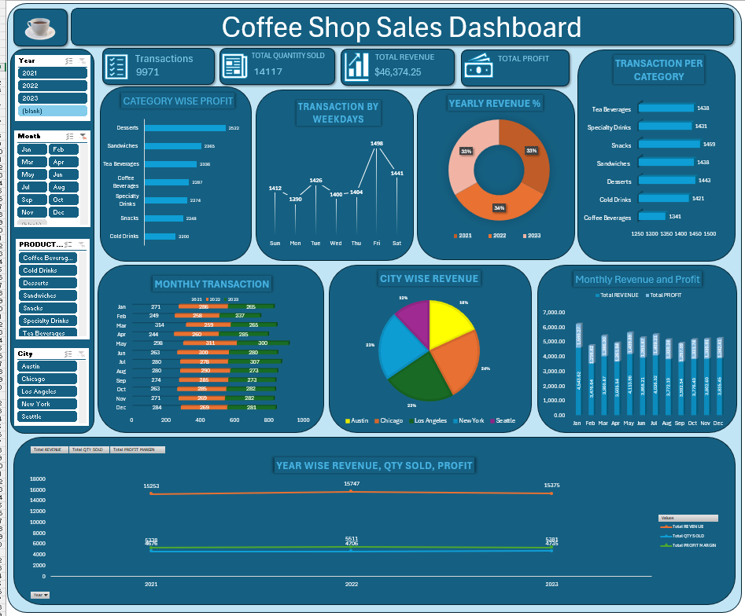

# ☕ Coffee Shop Sales Dashboard (Excel)

## 📋 Project Overview
This project presents a **Coffee Shop Sales Dashboard** created using **Microsoft Excel**.  
The dashboard analyzes sales performance across multiple years (2021–2023), product categories, and cities.  
It highlights key metrics such as transactions, quantity sold, revenue, and profit to support business decisions.

---

## 📁 Folder Structure
📂 Coffee_Shop_Sales_Dashboard
│
├── 📊 Dashboard
│ └── Coffee_Shop_Sales_Dashboard.xlsx # Excel Dashboard file
│
├── 📈 Dataset
│ └── Coffee_Shop_Sales_Data.xlsx # Source dataset
│
├── 🖼️ Image
│ └── Dashboard.png # Dashboard image/screenshot
│
└── 📄 README.md # Documentation file

---

## 📊 Key Metrics
- **Total Transactions:** 9,971  
- **Total Quantity Sold:** 14,177  
- **Total Revenue:** $46,374.25  

---

**Insight:**  
- 2022 achieved the highest revenue and profit.  
- 2023 showed a slight decline compared to 2022.  
- Desserts Product Category generate the highest profit.  
- Snacks and Desserts Product Category have high transaction counts.  
- Chicago City generates the highest revenue and Austin has the lowest revenue, suggesting room for marketing improvement.  
- Friday records the highest number of transactions (1,484) and Sunday shows the lowest activity.  
- May and June are peak months for sales. January and December show moderate performance.    

---

## 🚀 Recommendations
- Increase promotional efforts in low-performing cities (e.g., Austin).  
- Offer weekday discounts (Sunday–Wednesday) to boost low-traffic days.  
- Expand Dessert offerings to increase profit margin.  
- Analyze the 2023 decline in revenue and profit to identify potential causes.  

---

## 🧰 Tools & Techniques Used
- **Microsoft Excel:** Dashboard creation, Pivot Tables, Charts, and Slicers.   
- **Data Visualization:** Bar charts, line graphs, and interactive slicers.  

---

## ⚙️ How to Use
1. Open the file `Dashboard/Coffee_Shop_Sales_Dashboard.xlsx` in Excel.  
2. Use the slicers to filter by **Year**, **Month**, **City**, or **Product Category**.  
3. Review charts for insights on sales, revenue, and profit trends.  
4. Refer to `Dataset/Coffee_Shop_Sales_Data.xlsx` for raw data.  

---

## 🧩 Example Dashboard View

---

## 📬 Contact
**Author:** Priyank Shrivastava  
**Email:** priyankshrivastava5678@gmail.com  